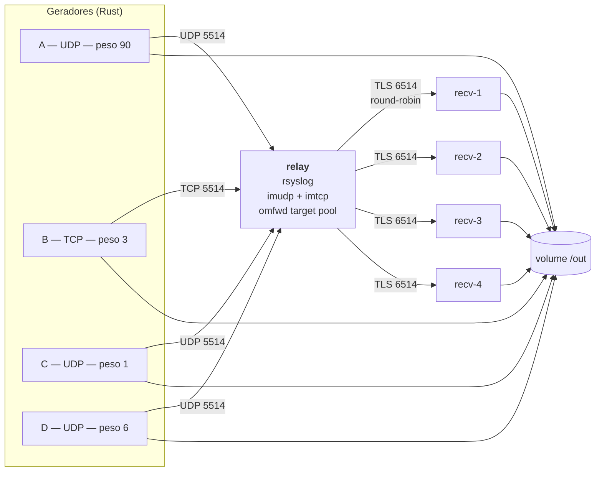

# HugeSyslogs

Ferramenta de teste de carga para medir o **desempenho** e, principalmente, o
**balanceamento round-robin** de um relay rsyslog que distribui mensagens para um pool de
receptores via TLS.

Sobe toda a topologia em containers podman, injeta carga controlada, coleta as métricas e
diz, com números, se o relay está distribuindo as mensagens igualmente entre os nós do pool.

```
enviadas: 750.001   recebidas: 750.001   perda: 0 (0,00%)   vazão: 50,0k msg/s

receptor      mensagens     fatia    desvio       p50       p99       máx
recv-1          187.481    25,00%    -0,00%     887µs     2,1ms    39,6ms
recv-2          187.534    25,00%    +0,00%     867µs     2,1ms    39,4ms
recv-3          187.483    25,00%    -0,00%     871µs     2,1ms    40,2ms
recv-4          187.503    25,00%    +0,00%     893µs     2,1ms    41,0ms
desvio máximo: 0,00%   ->  BALANCEADO
```

---

## Índice

- [O que a ferramenta responde](#o-que-a-ferramenta-responde)
- [Como funciona](#como-funciona)
- [Requisitos](#requisitos)
- [Instalação](#instalação)
- [Uso](#uso)
- [Referência do arquivo de configuração](#referência-do-arquivo-de-configuração)
- [Entendendo o relatório](#entendendo-o-relatório)
- [Onde ficam os resultados](#onde-ficam-os-resultados)
- [Como as métricas são medidas](#como-as-métricas-são-medidas)
- [Cenários úteis](#cenários-úteis)
- [Solução de problemas](#solução-de-problemas)
- [Desenvolvimento](#desenvolvimento)

---

## O que a ferramenta responde

1. O relay está distribuindo as mensagens **igualmente** entre todos os nós do pool?
2. Qual a **latência** ponta a ponta, por receptor?
3. Qual o **throughput** suportado antes de começar a perder mensagens?
4. Quanta mensagem se **perde**, e de qual gerador?
5. O comportamento muda quando a carga de entrada está **desbalanceada** entre os geradores?

---

## Como funciona

O caminho `relay → receptores` é **rsyslog falando com rsyslog**, exatamente como em produção.
Não há reimplementação de receptor syslog: o que se mede é o rsyslog de verdade.



| Papel                    | Implementação                                                   |
| ------------------------ | --------------------------------------------------------------- |
| Receptores               | container rsyslog (`imtcp` + `gtls`)                            |
| Relay                    | container rsyslog (`imtcp` + `imudp` + `omfwd` com target pool) |
| Geradores                | binário Rust, um container por gerador                          |
| Orquestração e relatório | binário Rust, rodando no host                                   |

O round-robin vem do **target pool nativo do `omfwd`**: basta passar um array em `target` e o
rsyslog distribui entre todos os alvos online, removendo os indisponíveis automaticamente.

Todos os containers ficam numa rede podman dedicada e se resolvem pelo nome. **Nenhuma porta é
publicada no host** e nenhuma porta privilegiada é usada.

| Perna              | Porta | Protocolo |
| ------------------ | ----- | --------- |
| geradores → relay  | 5514  | TCP e UDP |
| relay → receptores | 6514  | TCP + TLS |

---

## Requisitos

| Item         | Versão testada    | Observação                            |
| ------------ | ----------------- | ------------------------------------- |
| Rust / cargo | 1.96.0            | para compilar a ferramenta            |
| podman       | 6.1.1             | funciona em modo **rootless**         |
| openssl      | qualquer, no PATH | só necessário no modo TLS `certvalid` |

A imagem de container é construída a partir do **Ubuntu 26.04 LTS**, que traz rsyslog
**8.2512.0** e `rsyslog-gnutls` direto do repositório `main` — sem PPA.

Não é preciso ter rsyslog instalado no host.

---

## Instalação

### 1. Clonar e compilar

```bash
git clone <url-do-repositorio>
cd HugeSyslogs
cargo build --release
```

O binário fica em `./target/release/hugesyslogs`.

### 2. Construir a imagem de container

```bash
./target/release/hugesyslogs imagem
```

Isso executa um `podman build` em duas etapas: compila o binário Rust estaticamente contra musl
e o copia para uma imagem Ubuntu 26.04 com rsyslog. A mesma imagem serve de relay, de receptor e
de gerador — o papel é decidido pelo comando de cada container.

> Rode este comando de novo sempre que alterar o código Rust, senão os containers continuarão
> usando o binário antigo.

### 3. Criar o arquivo de configuração

```bash
cp config.exemplo.toml config.toml
```

Edite à vontade. A referência completa de cada parâmetro está [mais abaixo](#referência-do-arquivo-de-configuração).

---

## Uso

### Comandos

```bash
hugesyslogs validar  --config config.toml   # confere o TOML e testa as confs no rsyslogd -N1
hugesyslogs imagem                          # constrói a imagem de container
hugesyslogs executar --config config.toml   # ciclo completo do teste
hugesyslogs limpar                          # remove containers e rede deixados para trás
```

| Comando    | Para quê                                                                                                                                                                                                |
| ---------- | ------------------------------------------------------------------------------------------------------------------------------------------------------------------------------------------------------- |
| `validar`  | Valida a sintaxe do TOML, mostra o plano de carga com os pesos já convertidos em msgs/s e submete as configurações rsyslog geradas ao `rsyslogd -N1`. Não sobe nada. Use antes de rodar um teste longo. |
| `imagem`   | Constrói `localhost/hugesyslogs:latest`.                                                                                                                                                                |
| `executar` | Sobe a topologia, roda o teste, coleta as métricas, imprime o relatório e derruba tudo.                                                                                                                 |
| `limpar`   | Rede de segurança: remove qualquer container `hsb-*` e a rede `hugesyslogs-rede`.                                                                                                                       |

Há também `hugesyslogs gerar`, o modo interno que roda **dentro** do container de gerador. Você
normalmente não o invoca à mão.

#### Opções úteis

| Opção                | Efeito                                                                                              |
| -------------------- | --------------------------------------------------------------------------------------------------- |
| `--config <arquivo>` | Caminho do TOML. Padrão: `config.toml`.                                                             |
| `--imagem <tag>`     | Tag da imagem. Padrão: `localhost/hugesyslogs:latest`.                                              |
| `--manter`           | Não remove os containers ao final, para inspecionar logs e estado. Lembre de rodar `limpar` depois. |

### Fluxo típico

```bash
cp config.exemplo.toml config.toml
$EDITOR config.toml

./target/release/hugesyslogs validar     # confere antes de gastar tempo
./target/release/hugesyslogs imagem      # só na primeira vez ou após mudar código
./target/release/hugesyslogs executar
```

### O que acontece durante a execução

A ordem importa: se os geradores subissem antes do relay, as primeiras mensagens se perderiam e
contaminariam a medição de perda.

```
[1/8] cria a rede podman
[2/8] gera o certificado                (só no modo certvalid)
[3/8] gera os .conf e valida com rsyslogd -N1
[4/8] sobe os receptores                -> espera a porta 6514 abrir
[5/8] sobe o relay                      -> espera as portas 5514 TCP e UDP abrirem
[6/8] sobe os geradores                 -> aquecimento + duração
[7/8] espera os geradores, drena as filas, para relay e receptores
[8/8] monta o relatório e remove tudo
```

O passo 7 respeita um **período de drenagem** após o fim dos geradores, para a fila do relay
esvaziar. Sem isso, mensagens ainda em trânsito seriam contadas como perdidas.

Pode interromper com **Ctrl-C** a qualquer momento: a ferramenta derruba os containers antes de
sair. Um segundo Ctrl-C força a saída imediata (aí pode sobrar container — rode `limpar`).

---

## Referência do arquivo de configuração

### `[teste]`

| Campo              | Tipo    | Padrão      | Descrição                                                                      |
| ------------------ | ------- | ----------- | ------------------------------------------------------------------------------ |
| `duracao`          | duração | obrigatório | Por quanto tempo os geradores injetam carga.                                   |
| `aquecimento`      | duração | `0s`        | Janela inicial descartada das métricas, para o sistema estabilizar.            |
| `drenagem`         | duração | `10s`       | Espera após parar os geradores, para a fila do relay esvaziar.                 |
| `tamanho_mensagem` | inteiro | `512`       | Bytes do frame syslog, sem o `\n` do TCP. Mínimo 128.                          |
| `taxa`             | inteiro | obrigatório | Mensagens por segundo **no total**, repartidas entre os geradores pelos pesos. |
| `threads`          | inteiro | `4`         | Threads por gerador. Cada thread tem seu próprio socket.                       |
| `total_mensagens`  | inteiro | `0`         | Teto absoluto de mensagens. `0` = ilimitado, usa só a `duracao`.               |

Durações aceitam `"500ms"`, `"60s"`, `"5m"`, `"1h"` ou um número puro (segundos).

### `[relay]`

| Campo             | Tipo    | Padrão   | Descrição                                                           |
| ----------------- | ------- | -------- | ------------------------------------------------------------------- |
| `tamanho_fila`    | inteiro | `100000` | `queue.size` do `omfwd`.                                            |
| `workers_fila`    | inteiro | `1`      | `queue.workerThreads` do `omfwd`.                                   |
| `rebind_interval` | inteiro | `0`      | `rebindInterval` do `omfwd`: reconecta a cada N lotes. `0` desliga. |

### `[receptores]`

| Campo        | Tipo    | Padrão      | Descrição                                        |
| ------------ | ------- | ----------- | ------------------------------------------------ |
| `quantidade` | inteiro | obrigatório | Quantos nós no pool. Viram `recv-1`, `recv-2`, … |

### `[tls]`

| Campo  | Valores               | Padrão | Descrição                                          |
| ------ | --------------------- | ------ | -------------------------------------------------- |
| `modo` | `anon` \| `certvalid` | `anon` | Como o TLS entre relay e receptores é configurado. |

| Modo        | Receptor                       | Relay                          | Certificados                       |
| ----------- | ------------------------------ | ------------------------------ | ---------------------------------- |
| `anon`      | `StreamDriver.AuthMode="anon"` | `StreamDriverAuthMode="anon"`  | **nenhum, em lugar nenhum**        |
| `certvalid` | apresenta cert self-signed     | valida só a cadeia, não o nome | um cert, montado só nos receptores |

O modo `anon` criptografa o tráfego sem verificar nada — é o mais simples e o padrão. O
`certvalid` existe como alternativa caso o build de GnuTLS não ofereça ciphersuites anônimas.

Os dois cifram com a mesma força; o que muda é a autenticação:

|                   | `anon` (padrão)         | `certvalid`                   |
| ----------------- | ----------------------- | ----------------------------- |
| Cifra negociada   | `ADH-AES256-GCM-SHA384` | AES-256-GCM com certificado   |
| Autenticação      | **nenhuma**             | cadeia validada (não o nome)  |
| Resistente a MITM | não                     | sim                           |
| Versão TLS        | fixo em **1.2**         | permite 1.3                   |
| Certificados      | nenhum, em lugar nenhum | um, montado só nos receptores |

> O *Anonymous Diffie-Hellman* foi **removido do TLS 1.3**, então o modo `anon` fica
> necessariamente em TLS 1.2. Se precisar de TLS 1.3 ou de proteção contra
> man-in-the-middle, use `certvalid`.

### `[[gerador]]`

Cada bloco é **um container**. Declare quantos quiser, misturando TCP e UDP.

| Campo              | Tipo           | Padrão             | Descrição                                                                  |
| ------------------ | -------------- | ------------------ | -------------------------------------------------------------------------- |
| `nome`             | texto          | obrigatório        | Identificador único. Até 16 caracteres, apenas letras, números, `-` e `_`. |
| `proto`            | `tcp` \| `udp` | obrigatório        | Protocolo usado para falar com o relay.                                    |
| `peso`             | número         | `1`                | Participação na `taxa` total. Normalizado pela soma dos pesos.             |
| `threads`          | inteiro        | herda de `[teste]` | Sobrescrita individual.                                                    |
| `tamanho_mensagem` | inteiro        | herda de `[teste]` | Sobrescrita individual.                                                    |
| `taxa`             | inteiro        | —                  | Taxa absoluta em msgs/s. Quando presente, **o peso é ignorado**.           |

**Os pesos não precisam somar 100.** São normalizados pela soma. Com `taxa = 50000`:

```toml
[[gerador]]
nome = "A"
proto = "udp"
peso = 90     # -> 45.000 msg/s

[[gerador]]
nome = "B"
proto = "tcp"
peso = 3      # ->  1.500 msg/s

[[gerador]]
nome = "C"
proto = "udp"
peso = 1      # ->    500 msg/s

[[gerador]]
nome = "D"
proto = "udp"
peso = 6      # ->  3.000 msg/s
```

Use `hugesyslogs validar` para conferir a conversão antes de rodar.

### `[saida]`

| Campo       | Valores                       | Padrão         | Descrição                                                    |
| ----------- | ----------------------------- | -------------- | ------------------------------------------------------------ |
| `diretorio` | caminho                       | `./resultados` | Onde as execuções são gravadas.                              |
| `formato`   | `tabela` \| `json` \| `ambos` | `tabela`       | `tabela` imprime no terminal; `json` grava `relatorio.json`. |

---

## Entendendo o relatório

### Resumo

```
=== RESUMO ===
duração útil: 15,0s   enviadas: 750.001   recebidas: 750.001
perda: 0 (0,00%)   vazão: 50,0k msg/s | 24,4 MB/s
```

`enviadas` e `recebidas` contam **só a janela útil**, ou seja, já descontado o aquecimento.
Se `recebidas` for maior que `enviadas`, o relatório reporta como **duplicadas** em vez de perda.

### Por receptor — a tabela que importa

```
receptor      mensagens     fatia    desvio       p50       p99       máx
recv-1          187.481    25,00%    -0,00%     887µs     2,1ms    39,6ms
```

| Coluna              | Significado                                                                       |
| ------------------- | --------------------------------------------------------------------------------- |
| `mensagens`         | Quantas aquele nó recebeu.                                                        |
| `fatia`             | Percentual do total.                                                              |
| `desvio`            | Diferença para a fatia ideal (`100% / n`). É aqui que o desbalanceamento aparece. |
| `p50`, `p99`, `máx` | Percentis de latência ponta a ponta daquele receptor.                             |

O veredito usa o **desvio máximo** entre os receptores:

| Desvio máximo | Veredito        |
| ------------- | --------------- |
| ≤ 1%          | `BALANCEADO`    |
| 1% – 5%       | `DESVIO LEVE`   |
| > 5%          | `DESBALANCEADO` |

### Por gerador

```
gerador     proto   fatia     enviadas    recebidas             perdidas
A             udp  90,00%      675.001      675.001            0 (0,00%)
```

Permite isolar perdas por protocolo — típico em UDP sob carga alta.

### Origem x relay

```
=== ORIGEM x RELAY (cadeia vista pelo receptor) ===
origem (emissor)     relay (encaminhou)      mensagens     fatia
gen-A                hsb-relay                  22.400    70,00%
gen-B                hsb-relay                   9.600    30,00%
```

Mostra a cadeia completa **como o receptor a enxerga**: quem produziu o log e quem o
encaminhou. Útil para confirmar que o HOSTNAME original sobreviveu ao salto pelo relay e,
em topologias com mais de um relay, para ver por qual deles cada mensagem passou.

### Avisos

Bloco `=== AVISOS ===`, exibido só quando há algo a reportar:

- gerador emitindo abaixo de 95% da taxa configurada (o gargalo pode ser o próprio gerador);
- erros de envio;
- latências negativas, indicando relógio inconsistente;
- linhas ilegíveis nos logs dos receptores.

### Conferência

```
=== CONFERÊNCIA (impstats do relay, inclui o aquecimento) ===
recebidas pelo relay: 999.979   encaminhadas: 999.979   na fila ao final: 0
```

Vem do `impstats` do próprio rsyslog, como fonte **independente** da contagem feita nos logs dos
receptores. Se os dois números divergirem muito, desconfie da medição. Estes contadores são
cumulativos e **incluem o aquecimento**, então não batem com a linha `enviadas` do resumo — isso
é esperado.

---

## Onde ficam os resultados

Cada execução cria um diretório com carimbo de data e hora:

```
resultados/2026-09-16_164443/
├── conf/
│   ├── relay.conf           # configuração rsyslog usada no relay
│   ├── recv-1.conf          # … e em cada receptor
│   ├── recv-2.conf
│   └── recv-3.conf
├── certs/                   # só no modo certvalid
├── out/
│   ├── recv-1.log           # mensagens recebidas, uma linha por mensagem
│   ├── recv-2.log
│   ├── recv-3.log
│   ├── relay-stats.log      # impstats do relay, em JSON
│   ├── gerador-A.json       # o que cada gerador diz ter enviado
│   └── gerador-B.json
└── relatorio.json           # se formato = json ou ambos
```

As configurações em `conf/` são úteis por si só: são rsyslog válido, prontas para copiar para um
ambiente real.

---

## Como as métricas são medidas

Cada mensagem é um frame RFC5424 com os campos de medição no **início** do corpo:

```
<134>1 2026-09-16T12:00:00.000000Z gen-A hsb - - - g=A s=4211 t=1758024000123456789 AAAA...
                                   \_HOSTNAME_/         \_ gerador, sequência, envio _/ \pad/
```

O campo `HOSTNAME` recebe o **hostname real do container** que emitiu a mensagem (`gen-A`,
`gen-B`, …). O relay encaminha com `template="RSYSLOG_SyslogProtocol23Format"`, que é RFC5424 e
**preserva o HOSTNAME original** em vez de sobrescrevê-lo com o nome do próprio relay.

No receptor, as duas pontas da cadeia ficam disponíveis em propriedades distintas do rsyslog:

| Propriedade  | Significado                                                                 |
| ------------ | --------------------------------------------------------------------------- |
| `%hostname%` | quem **produziu** o log — o emissor original, preservado ao longo da cadeia |
| `%fromhost%` | quem **encaminhou** — o peer imediato da conexão, ou seja, o relay          |

O receptor grava as duas, mais os primeiros 90 caracteres do corpo, descartando o padding:

```rsyslog
template(name="hsb" type="string"
         string="%timegenerated:::date-rfc3339% origem=%hostname% relay=%fromhost% %msg:1:90%\n")
```

Resultado: cada linha do log tem tamanho fixo, **independente do `tamanho_mensagem`**. Testar com
mensagens de 8 KB não transforma o disco em gargalo.

```
2026-09-16T20:59:48.310910+00:00 origem=gen-A relay=hsb-relay g=A s=0 t=1789592388087502621
```

| Métrica               | Origem                                                                             |
| --------------------- | ---------------------------------------------------------------------------------- |
| Balanceamento         | contagem de linhas de cada `recv-N.log`                                            |
| Latência              | `timegenerated` do rsyslog menos o `t` do gerador, num histograma HDR por receptor |
| Throughput            | total recebido ÷ duração útil                                                      |
| Perda                 | `enviadas` (JSON dos geradores) menos recebidas, por gerador                       |
| Cadeia origem → relay | `%hostname%` e `%fromhost%` de cada linha                                          |
| Conferência           | `impstats` do relay                                                                |

Os containers compartilham o clock do kernel do host, então comparar os dois carimbos é válido
sem nenhuma sincronização de relógio.

---

## Cenários úteis

**Descobrir o teto de throughput.** Suba `taxa` até a perda sair de zero ou o aviso de gerador
lento aparecer.

**Testar desbalanceamento de entrada.** Pesos muito assimétricos (`90/3/1/6`) verificam se a
distribuição na saída continua uniforme mesmo com a entrada torta.

**Simular queda de um nó do pool.** Rode com `--manter` ou, em outro terminal, durante o teste:

```bash
podman stop hsb-recv-3
```

O relatório deve acusar `DESBALANCEADO` e mostrar os demais absorvendo a carga.

**Isolar perda de UDP.** Declare dois geradores com o mesmo peso, um `tcp` e outro `udp`, e
compare a coluna `perdidas` de cada um.

**Medir o efeito dos workers de fila.** Varie `relay.workers_fila` e compare o desvio máximo.

---

## Solução de problemas

**`a imagem localhost/hugesyslogs:latest não existe`**
Rode `hugesyslogs imagem`.

**`o container hsb-recv-1 morreu antes de abrir a porta`**
A ferramenta anexa os logs do container à mensagem de erro. Normalmente é erro de sintaxe na
configuração rsyslog — rode `hugesyslogs validar` para ver o diagnóstico do `rsyslogd -N1`.

**Avisos `CA certificate is not set` nos logs dos receptores**
Esperado no modo `anon` e inofensivo. São três avisos informativos; o listener sobe e opera
normalmente. No ADH não existe certificado nenhum — é justamente esse o ponto.

**`openssl s_client` na porta 6514 parece indicar que não há TLS**

Sintoma típico:

```
$ openssl s_client -connect localhost:6514
SSL handshake has read 0 bytes and written 1540 bytes
no peer certificate available
New, (NONE), Cipher is (NONE)
```

**Isso não significa texto puro.** Repare que o `openssl` *escreveu* o ClientHello e leu
**zero bytes**: o servidor rejeitou e fechou. É a assinatura de *no shared cipher*. Em texto
puro o rsyslog engoliria o ClientHello como se fosse uma mensagem e manteria a conexão aberta.

A causa é que o modo `anon` usa *Anonymous Diffie-Hellman* e o **OpenSSL não oferece
ciphersuites anônimas por padrão**. Habilitando-as, o handshake fecha normalmente:

```bash
openssl s_client -connect recv-1:6514 -tls1_2 -cipher 'ADH:@SECLEVEL=0'
# New, TLSv1.2, Cipher is ADH-AES256-GCM-SHA384
```

Ou, com o cliente nativo do GnuTLS:

```bash
gnutls-cli --priority "NORMAL:+ANON-ECDH:+ANON-DH" --insecure --port 6514 recv-1
# - Handshake was completed
```

Para conferir a criptografia de forma independente do cliente, capture o tráfego e procure um
marcador conhecido das mensagens — o padding é uma sequência de `A`:

```bash
podman exec <receptor> tcpdump -i any -s 0 -w /out/cap.pcap port 6514   # em outro terminal
podman exec <receptor> sh -c "tcpdump -r /out/cap.pcap -A | grep -c 'AAAA'"
# 0  ->  o tráfego está cifrado
```

**Sobrou container de uma execução interrompida**
```bash
hugesyslogs limpar
```

**Perda alta só no UDP**
Buffer de socket estourando sob carga. O `imudp` já usa `rcvbufSize="16m"`; reduza a `taxa` ou
distribua a carga entre mais geradores UDP.

**Gerador emitindo abaixo da taxa configurada**
O gargalo é o gerador, não o relay. Aumente `threads` ou divida a carga em mais geradores.

**Mudei o código e nada mudou**
Os containers usam o binário embutido na imagem. Rode `hugesyslogs imagem` de novo.

---

## Desenvolvimento

```bash
cargo build --release     # compilar
cargo test                # testes unitários
cargo clippy --release    # lint
```

### Estrutura

```
src/
├── main.rs             # CLI (clap): validar | imagem | executar | limpar | gerar
├── config.rs           # leitura do TOML, validação, normalização dos pesos
├── certs.rs            # certificado self-signed via openssl
├── rsyslog.rs          # geração das confs do relay e dos receptores
├── podman.rs           # wrapper fino sobre a CLI do podman
├── orquestrador.rs     # ciclo de vida: subir, esperar, parar, drenar
├── gerador.rs          # modo gerador: TCP/UDP, controle de taxa, threads
├── metricas.rs         # leitura dos logs, histogramas, contagens
└── relatorio.rs        # tabelas e JSON
```

### Dependências

`clap`, `serde`, `toml`, `serde_json`, `chrono`, `hdrhistogram`, `ctrlc`, `anyhow`.

Não há biblioteca de TLS em Rust: todo o TLS é responsabilidade do rsyslog. O gerador usa
`std::thread` com sockets bloqueantes, sem runtime assíncrono.

### Convenção de idioma

Todo o projeto — código, comentários, mensagens de commit, saída no terminal, documentação e
mensagens de erro — é escrito em **português do Brasil**.
